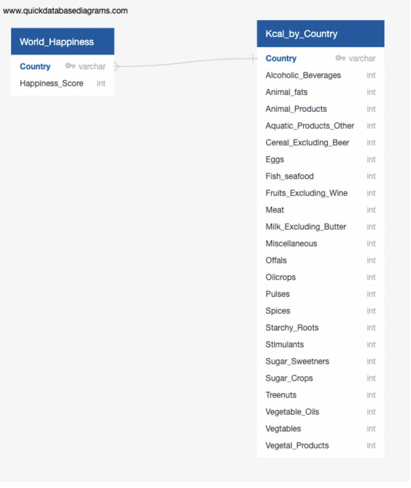

# OSU Data Bootcamp Final Project (Group 5)

## Topic
The World Happiness Report uses global survey data to rank more than 150 countries worldwide based on the levels of happiness and well-being. It measures "happiness" based on six criteria: income, healthy life expectancy, having someone to count on in times of trouble (family size), generosity, freedom and trust, with the latter measured by the absence of corruption in business and government. Our goal is to determine if a country's cultural dietary habits predict their World Happiness Score.

## Data Sources
 - World Happiness Dataset: https://www.kaggle.com/datasets/hari31416/world-happiness-report
 - Covid19 Healthy Diet Dataset: https://www.kaggle.com/datasets/mariaren/covid19-healthy-diet-dataset

## Questions
- Does the dietary breakdown predict the countries' happiness score?
- Does obesity correlate to happiness at the same rate as carbohydrate intake?
- Does alcohol consumption alone contribute to happiness?

## Discovery

Aaron

### Python 
The raw data from Covid19 Healthy Diet Dataset was uploaded to Pandas. The following steps was utilized to clean the data:
- `df.describe()`: creates descriptive statistics of a Pandas DataFrame
- `df.dtypes`: shows the data type of each column in the DataFrame
- `df.drop`: method to eliminate specified labels from rows or columns in a DataFrame
- `df.isnull().sum()`: returns the number of missing values (NaN) in each column of the DataFrame
- `df.dropna()`: removes rows or columns with missing values from a DataFrame

The final result was saved as kcal_by_country_df.csv with an end result of 170 total countries. (food_supply_df)


### Data Visualization Entity Relationship Diagram (Shameen Khan)  
 
The kcal_by_country.csv provided data that was ready to be organized into a entity relationship diagram. The two data sets were then detailed into data type, primary key and each cateogory that could be potentially used in the linear regression. The first table is called "World_Happiness" and includes the data of each "Country" and their "Happiness Score". The second table "Kcal_by country" includes "Country", "Animal_fats", "Animal_Products", and many more which are included in the image below.  
 
Entity Relationship Diagram
 

 
 

### PostgreSQL 

The cleaned datasets and the QuickDBD Diagram were loaded into PGAdmin. Displaying the data in tables including one with all the data merged. There was some additional changes made to both datasets to make sure the Key data (Country) was matching. Below is the final result.

<p align="center">

</p><br/>

### Predictive Model
Given that we have multiple independent data points trying to predict one numerical value, we need to use Multiple Linear Regression for our model. Before we build the model, we needed to ensure that each individual independent variable has a linear relationship to the happiness score.  To do this, I created a graph of each independent variable to happiness scores

#### Example of a food type that DID correlate:


#### Example of a food type that DID NOT correlate:


In total, there were 10 independent variables that correlated with happiness:
- Alcoholic Beverages
- Animal Fats
- Animal Products
- Cereal (Excluding Beer)
- Eggs
- Meat
- Milk (Excluding Butter)
- Vegetable Products
- Vegetables
- Obesity
 
We then used a Multiple Linear Regression model to predict World Happiness, using only the previously identified variables. The performance of the model shows that 59.95% of the data fit the regression model.

```
R squared: 59.95
Mean Absolute Error: 0.592440629442399
Mean Square Error: 0.5334936507188065
Root Mean Square Error: 0.7304064969034754
```
