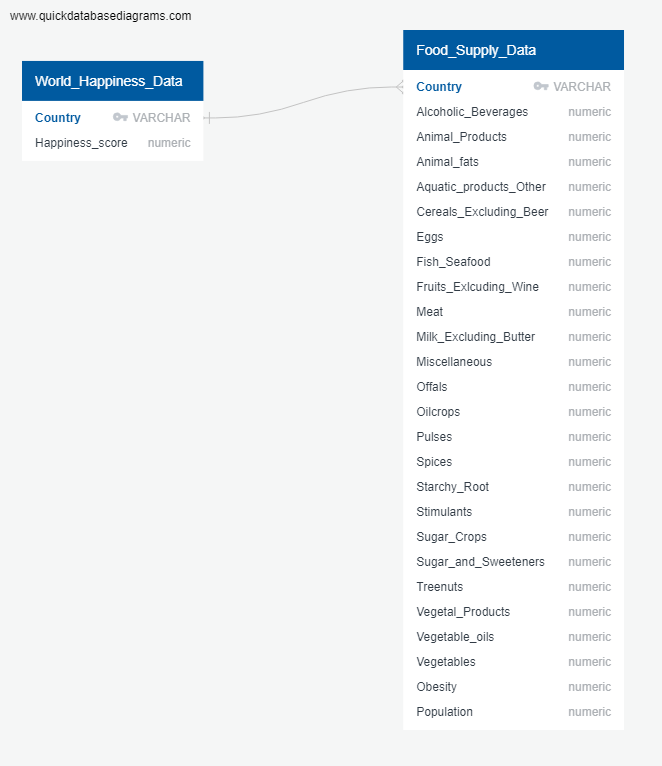

# DOES WHAT YOU EAT MAKE YOU HAPPY?

## Topic
The World Happiness Report is an annual report published by the United Nations Sustainable Development Solutions Network that ranks countries by their happiness levels. The report takes into account a variety of factors such as income, social support, freedom to make life choices, generosity, perceptions of corruption, and overall well-being to determine the happiness levels of people in different countries.

The report ranks countries on a scale of 0-10, with 10 being the highest level of happiness. Our goal is to determine if a country's dietary habits predict their score for the World Happiness Report. We chose dietary habits because it is not currently considered in the happiness report, but is a major part of human daily life.

## Data Sources
Our team utilized Kaggle.com to obtain our data sets. Kaggle is an online community of data scientists and machine learning practitioners, which allows users to find and publish data sets. In addition, Kaggle allows users to build models in a web-based data-science environment, work with other data scientists and machine learning engineers, and enter competitions to solve data science challenges.

 - World Happiness Dataset: https://www.kaggle.com/datasets/hari31416/world-happiness-report
   - The dataset has a more normalized form of the world happiness data from year 2015 to 2022. We chose to use data from 2021 as it compares to the data from the below dataset.
 - Covid19 Healthy Diet Dataset: https://www.kaggle.com/datasets/mariaren/covid19-healthy-diet-dataset
   - Of the the 4 datasets available, we chose to use the energy intake (kcal) dataset as we felt calories were the most commonly looked at metric. The kcal is calculated as percentage of total intake amount. The data set also includes COVID-19 data, which we removed since it is not pertinent to our study. The data used is from 2021.

## Questions
 - Can the foods we eat really affect our happiness?
 - Does being a vegetarian make us sad?
 - Do carbs, something we all love to eat, really bring us joy?
 - How do chocolates and candies affect our happiness?

## Discovery

### Python 

The World Happiness Dataset for 2021 was loaded into a pandas dataframe. The following steps were used to clean the data:
- `df.drop`: to remove all of the columns from the dataset except the country names and the overall happiness score.
- `df.isnull().sum()`: to test for any null values in the dataset. The result was '0', so we were good to proceed.
- `df.rename`: to change the remaining column names to something consistent with other Happiness Datasets, camel-casing.
- `df.to_csv`: uploading the finished dataframe so it can be uploaded into a Postgres database.


The raw data from the Covid19 Healthy Diet Dataset was uploaded to Pandas. The following steps were utilized to clean the data:
- `df.describe()`: creates descriptive statistics of a Pandas DataFrame.
- `df.dtypes`: shows the data type of each column in the DataFrame.
- `df.drop`: method to eliminate specified labels from rows or columns in a DataFrame.
- `df.isnull().sum()`: returns the number of missing values (NaN) in each column of the DataFrame.
- `df.dropna()`: removes rows or columns with missing values from a DataFrame.

The final result was saved as kcal_by_country_df.csv with an end result of 170 total countries. 


### Data Visualization Entity Relationship Diagram
 
The kcal_by_country.csv provided data that was ready to be organized into a entity relationship diagram. The two data sets were then detailed into data type, primary key, and each category that could be used in the linear regression. The first table is called "World_Happiness" and includes the data of each "Country" and their "Happiness Score". The second table "Kcal_by country" includes "Country", "Animal_fats", "Animal_Products", and many more which are included in the image below.  
 
Entity Relationship Diagram
 


### PostgreSQL

The cleaned datasets and the QuickDBD Diagram were loaded into PGAdmin. Displaying the data in tables including one with all the data merged. There was some additional changes made to both datasets to make sure the Key data (Country) was matching. Below is the final result.


## Phase 1

### Linear Regression Discovery
Given that we have multiple independent data points trying to predict one numerical value, we need to use Multiple Linear Regression for our model. Before we build the model, we needed to ensure that each individual independent variable has a linear relationship to the happiness score.  To do this, I created a graph of each independent variable to happiness scores.

#### Example of a food type that DID correlate:


#### Example of a food type that DID NOT correlate:


In total, there were 10 independent variables that correlated with happiness:
- Alcoholic Beverages
- Animal Fats
- Animal Products
- Cereal (Excluding Beer)
- Eggs
- Meat
- Milk (Excluding Butter)
- Vegetable Products
- Vegetables
- Obesity
 
We then used a Multiple Linear Regression model to predict the World Happiness Score, using only the previously identified variables. The performance of the model shows that 59.95% of the data fit the regression model.

```
R squared: 59.95
Mean Absolute Error: 0.592440629442399
Mean Square Error: 0.5334936507188065
Root Mean Square Error: 0.7304064969034754
```

## Phase 2

### Improving the Multiple Linear Regression Model

There are two tactics to improving our Multiple Linear Regression Machine Learning Model at this point: addressing the strength of the dataset and adjusting the hyperparameters. First, we're run individual Linear Regression Models for each of the ten categories identified to demonstrate correlations in the scatterplots. Measuring the coefficient of determination(r-squared value), we'll list out the datasets for their strength in the model and select to top five performing models.


Now we can approach re-working our Multiple Linear Regression Model with a restricted dataset.

```
# Selecting the top 5 columns for highest R-value during individual testing for X.
X = df[['Animal_fats', 'Animal_Products', 'Cereal_Excluding_Beer', 'Eggs', 'Meat']]
# happiness_score is the dependent variable.
y = df['happiness_score']
```

Next, we'll adjust the hyperparameters. In this circumstance, we'll be dealing with the test size and random_state modeling.

```
from sklearn.model_selection import train_test_split
x_train, x_test, y_train, y_test = train_test_split(X, y, test_size = 0.4, random_state = 150)
```

Then we'll engage in fitting our model, getting our coefficient and intercept, building our predicter dataset and comparing it to the test set. Finally, we'll evaluate our model.

```
# Model Evaluation
from sklearn import metrics
meanAbErr = metrics.mean_absolute_error(y_test, y_pred_model)
meanSqErr = metrics.mean_squared_error(y_test, y_pred_model)
rootMeanSqErr = np.sqrt(metrics.mean_squared_error(y_test, y_pred_model))
print('R squared: {:.2f}'.format(model.score(X,y)*100))
print('Mean Absolute Error:', meanAbErr)
print('Mean Square Error:', meanSqErr)
print('Root Mean Square Error:', rootMeanSqErr)
```

And our results:
```
R squared: 61.39
Mean Absolute Error: 0.5
Mean Square Error: 0.358
Root Mean Square Error: 0.598
```
## Technology Breakdown

 - Python (version 3.7) and Jupyter Notebook: utilized to clean and prepare csv files, convert to ready to use dataframes, create visual images for correlation, and save results as csv files or png images.
 - www.quickdatabasediagrams.com/: utilized to create Entity Relationship Diagram (ERD)
 - PostgreSQL and PGAdmin (version 4): utilized to combine two separate dataframes into one dataframe
 - Amazon AWS: utilized to support database management tasks
 - Portable Network Graphics (PNG): utilized to save charts, images, screenshots for later reference
 - Multiple Linear Regression Analysis: utilized to examine and determine food and happiness correlations
 - GitHub, Google sheets and Slack: utilized to document, exchange data, communicate and track group’s tasks and progress
 - Kaggle.com: data set resources

## Project Status
We continue to track our project requirements in Google Sheets. Our project plan and status is below. We are on track with this week's submission. Our presentation is located [here](https://docs.google.com/presentation/d/1QtRF6xd4Vp6nMN-invJrLExt_t4Q523mfcspb5VvcAQ/edit#slide=id.g21057df2cb3_0_74). We have already started our work on the dashboard.
